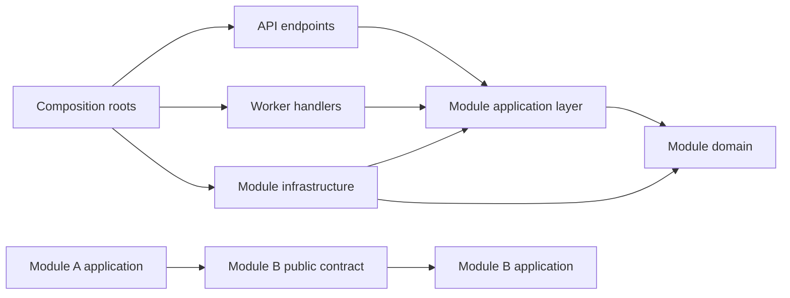
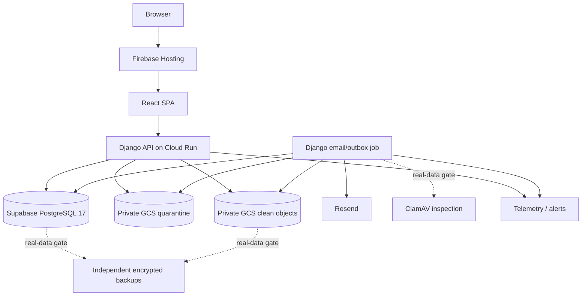
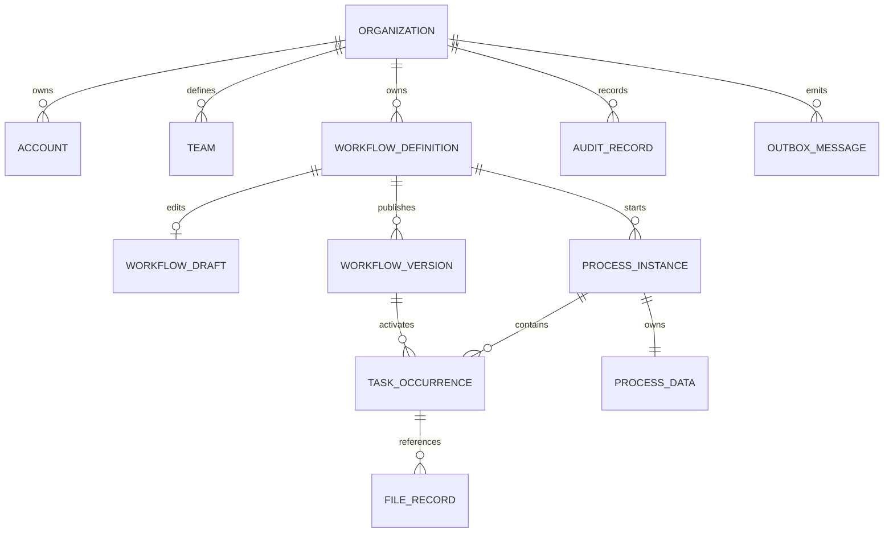

# Architecture Spine — Moviqo

## Design Paradigm

Modular monolith with hexagonal Django applications. The Django ASGI application and job commands are composition roots; business modules expose application services and own their domain and persistence mappings. The workflow runtime is a deterministic interpreter, not an embedded scripting host.



## Environment Gates

| Gate | Permitted data and audience | Required deployed path | Release conditions |
| --- | --- | --- | --- |
| Internal E2E beta | Company users and synthetic data only | Firebase landing/SPA → Cloud Run Django API → Supabase PostgreSQL, private GCS attachments, Resend email, and the minimal outbox/email job | Complete critical landing-to-Process journeys end to end; synthetic-only enforcement is fail-closed; capacity alerts and low scaling caps are active. Live malware scanning, independent backup/restore automation, and lifecycle schedules may remain disabled. |
| Real-data/public beta | Permitted customer data and invited beta users | Same application architecture, with production adapters and scheduled operations enabled | Live file inspection, daily independent backups, successful restore evidence, required lifecycle schedules, tenant-isolation/security gates, accessibility evidence, and all applicable release checks pass. Missing safeguards block startup or promotion. |

Moving between gates changes configuration and operational adapters, not domain behavior, API contracts, or persisted state semantics.

## Invariants & Rules

### AD-1 — Modular monolith and module ownership `[ADOPTED]`

- **Binds:** all backend capabilities
- **Prevents:** microservice boundaries, shared-table coupling, or cyclic module dependencies being chosen independently
- **Rule:** Ship one backend codebase as API and worker processes. Modules are `Organizations`, `WorkflowDesign`, `WorkflowRuntime`, `Files`, `Messaging`, and `Governance`. A module may call another only through its public application contract or consume its integration event; it never imports another module's domain or persistence implementation and never reads or writes another module's tables directly.

### AD-2 — Tenant context and data ownership `[ADOPTED]`

- **Binds:** every protected resource and operation
- **Prevents:** cross-Organization reads, writes, identifiers, joins, caches, jobs, or files
- **Rule:** Derive one immutable `TenantContext` from the authenticated active Membership for every protected request or job. Every tenant row carries `OrganizationId`; tenant relationships use Organization-scoped foreign keys; application authorization and PostgreSQL row-level security both deny missing or mismatched context. At each outer transaction, set tenant identity with transaction-scoped `SET LOCAL`; tenant tables use `FORCE ROW LEVEL SECURITY`; runtime roles neither own protected tables nor hold `BYPASSRLS`; migrations and maintenance use separate restricted credentials. Connection-pool reuse must never preserve tenant state beyond the transaction. Operator-only historical records live in a separate schema and are unreachable from tenant endpoints.

### AD-3 — One command, one transaction, one evidence trail `[ADOPTED]`

- **Binds:** all state-changing use cases
- **Prevents:** partial workflow transitions, duplicate retry outcomes, unaudited changes, or messages for rolled-back state
- **Rule:** A command enters through one application handler and commits business state, immutable audit records, its idempotency result, and outbox messages in one PostgreSQL transaction. The outer application coordinator owns that transaction; called module contracts join it and never commit independently. Retryable commands persist a uniquely constrained `(OrganizationId, CommandType, IdempotencyKey)` result and reject key reuse with different request content. The API never coordinates state by chaining independent HTTP calls. External delivery and binary cleanup occur after commit and cannot reverse committed business state.

### AD-4 — Relational control plane, JSONB dynamic model `[ADOPTED]`

- **Binds:** workflow definitions, forms, rules, Process Data, tasks, audit, and queries
- **Prevents:** per-customer schemas, runtime DDL, opaque storage for authorization-critical data, or duplicated Process Field values
- **Rule:** Store identity, tenancy, workflow metadata, instances, task occurrences, assignments, lifecycle, files, audit, idempotency, and outbox state relationally. Store immutable workflow-version snapshots, draft design documents, typed rule ASTs, form layouts, and Process Field values as schema-versioned JSONB keyed by stable IDs. One backend schema registry owns every document version: writers emit only the current version, readers validate and upcast every still-supported historical version, and golden fixtures protect immutable history. Authorization, assignment, lifecycle, status, and audit fields must remain relational.

### AD-5 — Immutable publication and serialized live-version execution `[ADOPTED]`

- **Binds:** workflow drafts, publication, restoration, active instances, and task writes
- **Prevents:** mutation of published history, mixed-version completion, duplicated downstream work, or publication racing a task submission
- **Rule:** A Workflow has one mutable draft with an optimistic revision and append-only immutable published snapshots with sequential versions. Publication and Save Draft/Complete Task lock the same Workflow head row. Each Task occurrence records activation version and submitted form revision; stale assignment or form revision rejects the whole attempt. A completion evaluates and commits against exactly one version, records it, then advances from the resulting execution point using the newest compatible publication.

### AD-6 — One safe, deterministic rule language `[ADOPTED]`

- **Binds:** Form properties, calculations, validation, and Conditional Routing
- **Prevents:** four incompatible evaluators, arbitrary code execution, client/server disagreement, or nondeterministic routing
- **Rule:** Persist a versioned, typed AST with ordered first-match branches and explicit default/else semantics; scripts and raw expressions are impossible. One backend interpreter validates and evaluates every context. Frontend authoring produces the AST, and preview/test calls the backend interpreter. Golden conformance fixtures bind serialization and semantics across versions.

### AD-7 — Server-owned identity, authorization, and API contract `[ADOPTED]`

- **Binds:** browser sessions, authorization, API clients, and errors
- **Prevents:** browser token leakage, frontend-only authorization, hand-maintained duplicate DTOs, or resource-existence disclosure
- **Rule:** Use a custom Django user model from the first migration, Django authentication, and verified-email/password accounts with same-origin `Secure`, `HttpOnly`, appropriately `SameSite` session cookies. Unsafe requests require Django CSRF validation. Trusted hosts, proxy headers, HTTPS redirects, and CSRF origins are explicit per environment and startup fails on unsafe production values. Every Django REST Framework endpoint authorizes server-side from active Membership and participation. REST/JSON is described by drf-spectacular OpenAPI and generates the TypeScript client. Errors use RFC 9457 Problem Details with stable application codes and correlation IDs, without sensitive diagnostics or cross-tenant existence signals.

### AD-8 — Private file quarantine and capability access `[ADOPTED]`

- **Binds:** attachments, previews, downloads, exports, and deletion
- **Prevents:** public objects, unscanned files entering Process Data, durable copied links, or metadata/binary divergence
- **Rule:** The database owns file metadata and lifecycle; private object storage owns binaries. Server-generated opaque object keys include a non-guessable tenant partition; authorized object-specific, upload-only grants target quarantine and expire within 15 minutes. A `FileInspectionPort` validates type and size and promotes only approved objects. The synthetic inspector can start only when the environment is explicitly classified `synthetic-only`; ambiguous or real-data configuration fails closed, and real-data environments require live malware inspection such as ClamAV. Task completion cannot consume pending, rejected, or infected files. Reads require fresh authorization and an object-specific read-only grant expiring within 15 minutes. Removal revokes application access transactionally and queues binary deletion; exports expire within 24 hours.

### AD-9 — Feature-sliced SPA with backend-authoritative state `[ADOPTED]`

- **Binds:** Moviqo.Front
- **Prevents:** page-to-page coupling, manual pathname branching, duplicated server state, business rules hidden in components, silent stale workflow edits, global editor Context, inconsistent page-level controls, or token-breaking visual drift
- **Rule:** Dependencies flow `app → pages → features → entities → shared`; lower layers never import higher layers, sibling features do not deep-import one another, and features expose public entry points. React Router owns canonical public/authenticated layouts, nested routes, route parameters, navigation, and deep-link restoration. TanStack Query is the single server-state layer for keyed catalogs and read models; unsaved Workflow/Form documents, canvas selection, revision conflicts, and explicit Save Draft orchestration remain in focused feature reducers with server revision tokens. Context is reserved for stable cross-application services such as session, language, query client, and theme. Tailwind CSS theme variables expose approved design tokens, while source-owned domain-free primitives under `shared/ui` contain native accessible controls and consistent composition. The Workflow Editor in `features/workflow-design` uses pinned `@xyflow/react` as a canvas adapter only: React Flow may own nodes/edges presentation, selection, positions, pan, zoom, and connection gestures, but the Moviqo Workflow document/reducer remains the single source of truth for semantics, unsaved state, explicit save, revisions, conflicts, assignment, validation, and publication. The existing draft endpoint communicates draft-save intent and accepts incomplete but structurally coherent authoring documents; do not add a duplicate save endpoint or a client-controlled flag that weakens validation. Publication-validation and publish commands load the authoritative saved revision, with publication completeness enforced by explicit server-side validation. Generic Form Grid and field controls remain in `shared/ui`; the typed field registry and runtime `TaskFormRenderer` live in `features/task-form`; the route-level Form Designer lives in `features/form-design`. Both authoring features consume public entity/document contracts without importing each other. A pinned stable dnd-kit package set may own Form Designer pointer/keyboard gesture state only; it never owns the Form document. Designer preview and runtime rendering use the same field renderers. No general form-state or form-builder library may duplicate backend or reducer authority without a later architecture decision. Components may provide immediate UX validation but cannot redefine authorization, routing, calculation, or completion semantics.

### AD-10 — PostgreSQL-backed asynchronous work `[ADOPTED]`

- **Binds:** email, assignment events, exports, malware scans, cleanup, lifecycle enforcement, and retries
- **Prevents:** request-bound external calls, lost notifications, duplicate sends, or premature broker operations
- **Rule:** Django job commands claim outbox and job rows with bounded PostgreSQL leases and `SELECT ... FOR UPDATE SKIP LOCKED`; handlers are idempotent, retry with backoff, and dead-letter with an operational reason. Company-only E2E deploys only the minimal outbox/email drain needed to test real notifications. Malware scan, backup, and Organization/data lifecycle commands are enabled at the real-data readiness gate. Local development may run commands continuously or on demand. API and jobs use the same application services and models. No message broker, Redis, Celery, or distributed cache enters the beta architecture without measured contention or latency evidence.

### AD-11 — Portable deployment topology with isolated environments `[ADOPTED]`

- **Binds:** local development, CI, Gate 1 UAT, and Gate 2 production
- **Prevents:** environment-specific application forks, customer data in non-production, or frontend access that bypasses the API
- **Rule:** Build one static SPA artifact and one immutable Python backend container image. The company-only E2E environment hosts React on Firebase Hosting, rewrites `/api/**` to Django ASGI on a scale-to-zero Cloud Run service, invokes only the outbox/email command as a Cloud Run Job, uses Supabase only as managed PostgreSQL, and keeps synthetic attachments in private Google Cloud Storage. Firebase/CDN configuration must never cache `/api/**`, session-specific, or authenticated responses; only public landing content and immutable hashed assets may be cached. Deploy in `us-east1` where applicable. E2E uses synthetic data only and stays inside no-cost allowances where practical; malware scanning, independent backups, and lifecycle schedules are added before permitted real customer data. Infrastructure is declarative under `Moviqo.Infrastructure` and every provider is behind an application adapter or standard protocol.

### AD-12 — Observable and evidence-gated operations `[ADOPTED]`

- **Binds:** API, worker, database, files, email, scheduled jobs, backups, and release pipelines
- **Prevents:** untraceable failures, Process Data leakage into diagnostics, or production promotion without required security evidence
- **Rule:** Emit structured OpenTelemetry-compatible logs, metrics, and traces with correlation IDs, tenant-safe metadata, and centralized redaction; never emit Process Data, credentials, tokens, private links, or file content. CI blocks promotion on test, tenant-isolation, authorization, file/export, dependency, secret, migration, and applicable OWASP ASVS Level 1 failures. Unresolved Critical/High and relevant Medium security findings block release.

### AD-13 — Independent logical backups and restoration evidence `[ADOPTED]`

- **Binds:** production PostgreSQL, attachment storage, and release readiness
- **Prevents:** provider backups being mistaken for portable recovery or a primary-provider failure destroying every copy
- **Rule:** In addition to managed-service recovery, export PostgreSQL logically and copy new attachment objects every 24 hours to encrypted storage outside the primary production failure boundary. Retain 7 daily and 4 weekly sets, alert on missed or failed runs, and target 24-hour RPO/RTO. Perform an isolated restore before real-data onboarding, quarterly, and after material storage changes; retain the result as release evidence.

### AD-14 — Lifecycle deletion is a governed workflow `[ADOPTED]`

- **Binds:** Organization dormancy, closure, deletion, backup expiry, and historical beta evidence
- **Prevents:** ad hoc cascades, orphaned binaries, recoverable personal data in the Historical Organization Register, or premature email reuse
- **Rule:** Governance owns a resumable, audited deletion saga with explicit deadlines and idempotent steps across tenant rows, credentials, files, exports, and backup-expiration tracking. Final deletion releases normalized emails only after tenant data and credentials are gone. The operator-only Historical Organization Register accepts only the PRD-approved opaque fields, expires each record within 24 months, and cannot restore or search a former Organization by identity.

### AD-15 — AI and distributed systems remain outside MVP `[ADOPTED]`

- **Binds:** Moviqo.AI and platform dependencies
- **Prevents:** unapproved Process Data disclosure, nondeterministic workflow decisions, and speculative operational complexity
- **Rule:** `Moviqo.AI` is not built, deployed, referenced, or granted data access in MVP. AI features, microservices, brokers, distributed caches, and real-time collaboration require a later requirements, threat-model, and measured-load decision.

### AD-16 — Test-first delivery contract `[ADOPTED]`

- **Binds:** every production behavior, defect correction, module boundary, tenant isolation rule, and release journey
- **Prevents:** behavior without executable evidence, regressions fixed without reproduction, mocked persistence hiding PostgreSQL failures, or coverage percentages substituting for meaningful tests
- **Rule:** Implement behavior through red → green → refactor: first commit a focused failing test that demonstrates the intended behavior or defect, then the smallest passing implementation, then refactor under green tests. Domain and interpreter behavior uses unit/table-driven tests; persistence, RLS, transactions, and concurrency use real PostgreSQL integration tests; module dependencies use architecture tests; API schemas use contract tests; critical landing-to-completed-Process journeys use Playwright with automated accessibility checks. Before real-data/public beta, retain manual keyboard and representative screen-reader evidence for critical journeys. CI blocks merges on affected test, isolation, contract, architecture, or applicable accessibility failures. Coverage is diagnostic and has no universal percentage target.

## Consistency Conventions

| Concern | Convention |
| --- | --- |
| Backend names | snake_case Python modules/functions; PascalCase classes; singular domain entities; commands use imperative intent; events use past tense; module public APIs live under `services` or `contracts` |
| Frontend names | kebab-case files; PascalCase components; camelCase functions; feature imports use each feature's public entry point |
| Identifiers | UUIDv7 for application entities; stable Workflow/element/field/option IDs survive versions; no sequential IDs cross the API |
| Tenant keys | Every tenant table includes `OrganizationId`; tenant-unique constraints and relationships include it |
| Time | UTC instants in `timestamptz`; IANA Organization timezone for interpretation/display; date-only values use ISO `YYYY-MM-DD` |
| Numbers and money | Invariant decimal persistence; explicit precision/scale; currency values always carry immutable ISO 4217 currency identity |
| JSON documents | `camelCase`, explicit `schemaVersion`, stable IDs as strings, unknown future fields rejected on writes and tolerated only by version-aware readers |
| HTTP | `/api/v1`; JSON; OpenAPI-generated client; RFC 9457 Problem Details; optimistic revision through ETag/`If-Match` or an equivalent generated contract |
| Mutation | Commands only; transaction boundary at application handler; idempotency key required for retryable business commands |
| Queries | Server-authorized and Organization-scoped; explicit projection and pagination; no unbounded tenant collection loads |
| Audit | Append-only semantic records in the same transaction as change; technical telemetry is separate and never substitutes for audit |
| Configuration | Environment variables and managed secrets; startup fails closed when required security configuration is absent |
| Localization | Moviqo-owned keys in Spanish and English with Spanish fallback; designer content remains verbatim; formatting occurs at presentation boundaries |
| Tests | Red → green → refactor; pytest unit/table tests for domain/interpreter; real PostgreSQL integration tests for persistence/RLS/concurrency; import-boundary architecture tests; API contract tests; Playwright plus automated accessibility checks for release journeys |

## Stack

| Name | Version |
| --- | --- |
| Python | 3.14.6 |
| Django | 5.2.15 LTS |
| Django REST Framework | 3.17.1 |
| Psycopg | 3.3.4 |
| drf-spectacular | 0.30.0 |
| PostgreSQL | 17.10 |
| Node.js | 26.7.0 |
| TypeScript | 6.0.x |
| React | 19.2.7 |
| Vite | 8.2.x |
| Tailwind CSS | 4.3.3 |
| `@tailwindcss/vite` | 4.3.3 |
| React Flow (`@xyflow/react`) | 12.11.2 |
| ClamAV | 1.5.3 |
| pytest | 9.1.1 |
| Playwright | 1.62.x |

## Structural Seed

```text
Moviqo.Back/
  pyproject.toml
  src/
    manage.py
    moviqo/
      settings/                 # environment settings and fail-closed checks
      asgi.py                   # HTTP composition root
      urls.py
      building_blocks/          # primitives only; no business concepts
      modules/
        organizations/
        workflow_design/
        workflow_runtime/
        files/
        messaging/
        governance/
      jobs/                     # short-lived worker command entry points
  tests/
    unit/
    integration/
    architecture/

Moviqo.Front/
  src/
    app/                        # bootstrap, routing, providers
    pages/                      # route composition
    features/                   # user-intent slices
    entities/                   # reusable entity views and query keys
    shared/                     # design system, generated API, utilities
  tests/
    e2e/

Moviqo.Infrastructure/          # rename empty misspelled placeholder before scaffolding
  environments/
    local/
    uat/
    production/
  modules/
  operations/
    backup/
    restore/
```





## Capability → Architecture Map

| Capability / Area | Lives in | Governed by |
| --- | --- | --- |
| Registration, verification, Membership, roles, Teams, tenant limits | `Organizations` | AD-2, AD-7, AD-14 |
| Workflow catalog, graph/Form/rule design, draft lease, validation, publication | `WorkflowDesign` | AD-1, AD-4, AD-5, AD-6 |
| Process start, Process Data, routing, calculations, states, task completion | `WorkflowRuntime` | AD-3, AD-4, AD-5, AD-6 |
| Assignment, Team claiming, My Work, Needs Attention | `WorkflowRuntime` with `Organizations.Contracts` | AD-1, AD-2, AD-3, AD-5 |
| Attachments, previews, downloads, cleanup | `Files` | AD-2, AD-8, AD-10 |
| Assignment and operational email | `Messaging` | AD-3, AD-10 |
| Audit views/exports, quotas, dormancy, closure, deletion | `Governance` | AD-2, AD-3, AD-12, AD-14 |
| Landing, onboarding, designer, runtime Forms, dashboards | `Moviqo.Front` | AD-7, AD-9 |
| Deployment, secrets, monitoring, backup/restore | `Moviqo.Infrastructure` | AD-11, AD-12, AD-13 |

## Deferred

- **Real-data safeguards:** live malware inspection, Backblaze B2 or equivalent independent backups, restore testing, and Organization/data lifecycle schedules are deferred from internal synthetic E2E but block any environment from accepting real customer data.
- **Free-tier capacity:** Firebase Hosting's 10 GB monthly transfer, Google Cloud Storage's eligible 5 GB allowance, Supabase's 500 MB database, Cloud Run compute quotas, and Resend's 3,000 emails/month are operating ceilings, not approved product limits. Monitor at 60/80/90%, cap instance scaling, preserve paid migration paths, and upgrade before an active Organization is impaired.
- **Frontend routing, query, and Designer interaction libraries:** React Router `7.18.0` provides declarative SPA routing and TanStack Query `5.101.4` owns server state; both are pinned after React 19.2.7 and TypeScript 6 compatibility checks. React Flow remains the Workflow canvas adapter, and dnd-kit remains the Form Designer gesture adapter. The source-owned typed field registry/Form Renderer remains authoritative; a second general form-state or form-builder library is intentionally not selected.
- **Provider-specific infrastructure modules:** decompose the adopted Firebase Hosting + Google Cloud Run/GCS + Supabase + Resend topology into reusable IaC modules during scaffolding; topology and environment isolation are already binding.
- **Redis, message broker, microservices, read replicas, and search engine:** revisit only when measured beta load or reliability needs exceed PostgreSQL-backed operation.
- **Multi-region availability and formal SLA:** revisit after beta demand and budget justify it.
- **MFA, SSO, passkeys, multi-Organization accounts, and external participants:** deferred by the PRD; preserve extension seams in identity contracts without implementing them.
- **AI-assisted design or execution:** requires explicit product scope, privacy boundaries, threat modeling, and deterministic fallback.
- **Cross-Organization analytics or arbitrary Process Data reporting:** not supported by the MVP storage contract; define a privacy-safe projection model before adding it.
